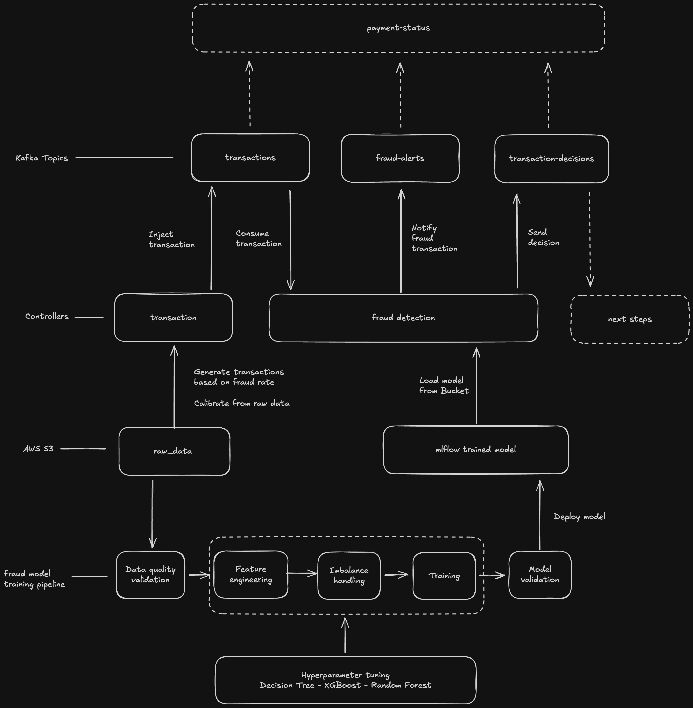

## Fraud Detection Model

### Resources
- **Dataset**: [Credit Card Fraud Detection – Kaggle](https://www.kaggle.com/datasets/mlg-ulb/creditcardfraud)

### Architecture

### Components

1. **EDA**
   - Data shape, memory usage
   - Basic statistics, total missing value, distribution
   - Transaction amount analysis
   - Time-based pattern analysis
   - Feature correlation
   - Fraud pattern discovery

2. **Preprocessing**
   - Load
   - Validate integrity, consistency, missing value, imbalance
   - Split
   - Scaling

3. **Imbalance Handling**
   - SMOTE

4. **Model Training**
   - Decision Tree
   - Random Forest
   - XGBoost

5. **Model Evaluation**
   - Precision
   - Recall
   - F1 Score
   - PR AUC

6. **Hyperparameter Tuning**
   - Grid Search
   - Random Search

7. **Transaction generator**
   - Fraud synthetic generator
8. **Fraud Detection service**
9. **Kafka architecture**