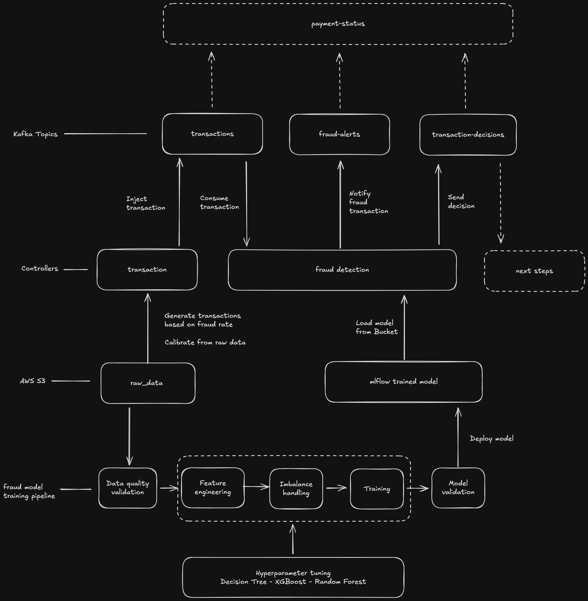

# Fraud Detection System

A real-time fraud detection service built with FastAPI, Kafka, and scikit-learn. The service consumes financial transactions from a Kafka topic, runs ML inference, and publishes decisions to downstream topics — with a REST API for direct prediction, topic management, and synthetic data injection.

## Related Projects

| Project | Description |
|---|---|
| [fraud-detection-ml-pipeline](https://github.com/phucvhd/fraud-detection-ml-pipeline) | Offline training pipeline (EDA → preprocessing → model training → evaluation → MLflow tracking) |
| [fraud-rag](https://github.com/phucvhd/fraud-rag) | RAG-based fraud analysis service for natural language querying over fraud cases |

## Architecture



**Data flow:**

```
Transaction Producer ──► Kafka (transactions) ──► Fraud Listener
                                                        │
                                                   FraudService
                                                  (ML inference)
                                                        │
                              ┌─────────────────────────┴──────────────────────┐
                    Kafka (transaction-decisions)          Kafka (fraud-alerts)
```

The REST API provides a synchronous `/fraud/validate` endpoint for the same inference path, and `/transaction/inject` for load-testing via Kafka.

## Stack

- **API**: FastAPI + Uvicorn
- **Messaging**: Apache Kafka (confluent-kafka)
- **ML Runtime**: scikit-learn, joblib (model loaded from S3 at startup)
- **Model Storage**: AWS S3 (packaged as `.tar.gz` with `model.joblib` + `scaler.joblib`)
- **Experiment Tracking**: MLflow (PostgreSQL backend, MinIO artifact store)
- **Infrastructure**: Docker Compose

## Project Structure

```
├── src/
│   ├── clients/
│   │   └── s3_client.py              # Boto3 S3 wrapper
│   ├── controllers/
│   │   ├── main_controller.py        # FastAPI app + lifespan (startup/shutdown)
│   │   ├── fraud_detection_controller.py  # POST /fraud/validate
│   │   ├── kafka_controller.py       # Kafka topic management endpoints
│   │   └── transaction_controller.py # Transaction generation + injection
│   ├── generators/
│   │   └── fraud_synthetic_generator.py  # Calibrated synthetic transaction generator
│   ├── kafka_consumers/
│   │   ├── kafka_listener.py         # Generic threaded Kafka consumer loop
│   │   └── fraud_listener.py         # Wires the listener to FraudService.fraud_handler
│   ├── kafka_producers/
│   │   ├── transaction_producer.py   # Burst-aware Kafka producer
│   │   └── adaptive_rate_producer.py # Rate-adjusting producer (lag-driven)
│   ├── schemas/
│   │   └── transaction.py            # Pydantic models (TransactionBase, TransactionCanonical)
│   └── services/
│       ├── fraud_service.py          # Feature engineering + ML inference + Kafka publishing
│       └── kafka_service.py          # Kafka produce/consume/admin operations
├── config/
│   ├── application.yaml              # All configuration (env var substitution supported)
│   ├── config_loader.py              # YAML loader with ${VAR:-default} env substitution
│   └── kafka_config.py               # Lazy-initialized Kafka Producer/Consumer/AdminClient
├── scripts/
│   ├── create-topics.sh              # One-shot topic creation
│   └── kafka-utils.sh                # Kafka utility helpers
├── docker-compose.yaml               # Kafka, Zookeeper, MLflow, MinIO, fraud-detection-service
├── Dockerfile
└── requirements.txt
```

## Prerequisites

- Python 3.12+
- Docker and Docker Compose
- AWS credentials with S3 read access (for model and training data)

## Quick Start

### 1. Environment variables

Create a `.env` file in the project root:

```env
AWS_ACCESS_KEY_ID=your_key
AWS_SECRET_ACCESS_KEY=your_secret
AWS_DEFAULT_REGION=us-east-1
AWS_BUCKET_NAME=your_bucket

MINIO_ACCESS_KEY_ID=minioadmin
MINIO_SECRET_ACCESS_KEY=minioadmin
```

### 2. Start infrastructure

```bash
# Create the shared network (required once)
docker network create fraud-net

# Start Kafka, Zookeeper, MLflow, MinIO
docker-compose up -d zookeeper kafka kafka-ui mlflow-db minio mlflow-server
```

### 3. Create Kafka topics

```bash
bash scripts/create-topics.sh
```

### 4. Start the service

```bash
# Via Docker Compose
docker-compose up -d fraud-detection-service

# Or locally
pip install -r requirements.txt
PYTHONPATH=. uvicorn src.controllers.main_controller:app --host 0.0.0.0 --port 8000 --reload
```

The API is available at `http://localhost:8000` and Swagger docs at `http://localhost:8000/docs`.

## Configuration

All configuration lives in `config/application.yaml`. Environment variables are substituted using `${VAR_NAME}` or `${VAR_NAME:-default}` syntax.

Key settings:

| Key | Description |
|---|---|
| `kafka.producer.transactions_per_second` | Base producer rate |
| `kafka.producer.burst_mode` | Enable burst cycles |
| `kafka.producer.burst_multiplier` | Rate multiplier during burst |
| `fraud_generator.fraud_rate` | Fraction of synthetic transactions that are fraudulent (default: 0.005) |
| `api.fraud_detection.model.id` | MLflow model ID to load from S3 at startup |
| `api.fraud_detection.kafka.listener_toggle` | Enable/disable the background Kafka consumer |
| `api.fraud_detection.kafka.topic` | Input topic the service consumes |
| `api.fraud_detection.kafka.decision_topic` | Output topic for all decisions |
| `api.fraud_detection.kafka.fraud_alerts_topic` | Output topic for fraud-only alerts |

## API Reference

### Health

| Method | Path | Description |
|---|---|---|
| GET | `/health` | Liveness check |

### Fraud Detection

| Method | Path | Description |
|---|---|---|
| POST | `/fraud/validate` | Run ML inference on a transaction dict. Publishes decision (and alert if fraud) to Kafka. Returns `TransactionCanonical`. |

**Request body** — raw transaction dict with `Time`, `Amount`, `V1`–`V28`, `transaction_id`.

### Transaction Generation

The generator is calibrated from the [Kaggle Credit Card Fraud dataset](https://www.kaggle.com/datasets/mlg-ulb/creditcardfraud) loaded from S3 at startup. It reproduces realistic V-feature distributions and stratified fraud amounts.

| Method | Path | Description |
|---|---|---|
| GET | `/transaction/{time_interval}` | Generate one transaction (normal or fraud based on `fraud_rate`) |
| GET | `/transaction/normal/{time_interval}` | Generate one normal transaction |
| GET | `/transaction/fraud/{time_interval}` | Generate one fraudulent transaction |
| POST | `/transaction/inject?duration_seconds=N` | Produce synthetic transactions to Kafka for N seconds |

### Kafka Management

| Method | Path | Description |
|---|---|---|
| GET | `/kafka/topics` | List all topics |
| POST | `/kafka/topic/{topic_name}` | Publish a message (`{"key": "...", "value": {...}}`) |
| GET | `/kafka/topic/{topic_name}` | Consume one message (10s timeout) |
| POST | `/kafka/topic/{topic_name}/create` | Create a topic |
| DELETE | `/kafka/topic/{topic_name}/delete` | Delete a topic |

## Model

The service loads a pre-trained model archive from S3 at startup (`models/{model_id}.tar.gz`). The archive must contain:

- `model.joblib` — fitted scikit-learn classifier (Random Forest, XGBoost, or Decision Tree)
- `scaler.joblib` (optional) — fitted `StandardScaler` for the `Amount` feature

**Feature engineering** applied at inference time:
- `hour_of_day` — `(Time / 3600) % 24`
- `day_period` — 0–3 bucketed from hour
- `time_since_start` — `Time / Time.max()`
- `log_amount` — `log1p(Amount)`
- `amount_scaled` — scaler transform (falls back to `log_amount` if no scaler)

The model is trained on the full feature set: `Time`, `V1`–`V28`, and the five engineered features above.

## Kafka Topics

| Topic | Direction | Content |
|---|---|---|
| `transactions` | Input | Raw transaction dicts produced by the generator or external producers |
| `transaction-decisions` | Output | All `TransactionCanonical` decisions (fraud and non-fraud) |
| `fraud-alerts` | Output | `TransactionCanonical` decisions where `is_fraud=true` only |

## Development

### Run tests

```bash
PYTHONPATH=. pytest test/unit/ -v
```

### Kafka UI

Available at `http://localhost:8080` when running via Docker Compose. Shows topic offsets, consumer group lag, and message browsing.

### MLflow UI

Available at `http://localhost:5001`. Tracks training runs from the [ml-pipeline](https://github.com/phucvhd/fraud-detection-ml-pipeline) project.

### CI

GitHub Actions runs unit tests on every push to `main` or `feature/**` branches. See `.github/workflows/ci.yml`.
